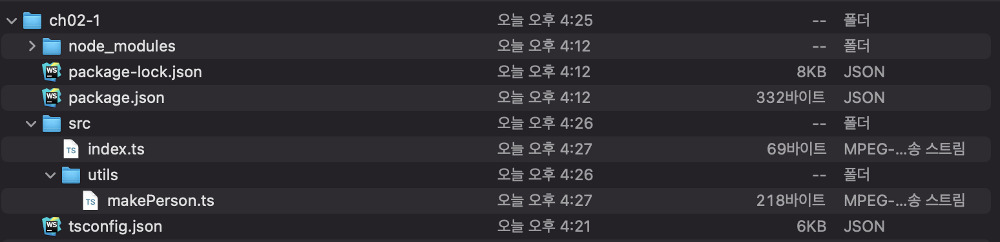

# 02장 타입스크립트 프로젝트 생성과 관리

<details><summary>Table of Contents</summary>

-   타입스크립트 프로젝트 만들기 [🔗](#02-1-타입스크립트-프로젝트-만들기)
    -   node js 프로젝트 생성하기 [🔗](#node-js-프로젝트-생성하기)
    -   프로젝트 생성자 관점에서 패키지 설치하기 [🔗](#프로젝트-생성자-관점에서-패키지-설치하기)
    -   프로젝트 이용자 관점에서 패키지 설치하기 [🔗](#프로젝트-이용자-관점에서-패키지-설치하기)
    -   tsconfig.json 파일 만들기 [🔗](#tsconfigjson-파일-만들기)
    -   src 디렉터리와 소스 파일 만들기 [🔗](#src-디렉터리와-소스-파일-만들기)
    -   package.json 수정 [🔗](#packagejson-수정)
-   모듈 이해하기 [🔗](#02-2-모듈-이해하기)
    -   모듈과 모듈화 [🔗](#모듈과-모듈화)
    -   index.ts 파일의 모듈화 [🔗](#indexts-파일의-모듈화)
    -   export 키워드 [🔗](#export-키워드)
    -   import 키워드 [🔗](#import-키워드)
    -   import * as 구문 [🔗](#import--as-구문)
    -   export deafult 키워드 [🔗](#export-default-키워드)
    -   외부 패키지를 사용할 때 import 문 [🔗](#외부-패키지를-사용할-때-import-문)
-   tsconfig.json 파일 살펴보기 [🔗](#02-3-tsconfig.json-파일-살펴보기)
    -   tsconfig.js 주요 설정 [🔗](#tsconfigjs-주요-설정)

</details>

## 02-1 타입스크립트 프로젝트 만들기

타입스크립트 개발 = node js 프로젝트 생성 → 개발 언어를 타입스크립트로 설정  

### node js 프로젝트 생성하기
`npm init --y` 명령을 통해 node js 프로젝트를 만들면 `package.json` 파일이 생성된다  
`package.json`은 node js가 관리하는 패키지 관리 파일로서 프로젝트 정보와 관련 패키지 정보가 기록된다  

### 프로젝트 생성자 관점에서 패키지 설치하기
`npm install` 또는 `npm i` 명령으로 필요한 패키지 설치 → `package.json` 파일에 패키지 정보 자동으로 기록  
* 패키지 설치 옵션

|npm i 옵션|의미|단축 명령|
|:---------:|:----:|:-----:|
|--save|프로젝트 실행할 때 필요한 패키지 설치|-S|
|--save-dec|프로젝트 개발할 때 필요한 패키지 설치|-D|

타입스크립트 프로젝트를 위해서 `typescript`와 `ts-node` 패키지를 전역으로 설치한다.  
다른 개발자를 위해서 `-D`옵션으로 `typescript`와 `ts-node` 패키지를 설치하기도 한다.

```shell
$ npm i -D typescript ts-node
```

타입스크립트는 자바스크립트와 다른 언어이기 때문에 자바스크립트 컴파일러에 맞추어서 개발된 라이브러리를 타입스크립트 컴파일러가 이해할 수 있는 라이브러리로 대체해서 사용해야한다.  
따라서, 자바스크립트 라이브러리에 @types가 붙은 타입스크립트 라이브러리를 설치해서 사용한다.  

```shell
$ npm i -D @types/node
```

### 프로젝트 이용자 관점에서 패키지 설치하기

`packages.json` 파일이 있는 프로젝트 디렉터리에서 `npm i` 명령을 실행하면 필요한 패키지가 `node_modules` 디렉터리에 자동으로 설치된다.  
  
### 프로젝트 이용자 관점에서 패키지 설치하기

`packages.json` 파일이 있는 프로젝트 디렉터리에서 `npm i` 명령을 실행하면 필요한 패키지가 `node_modules` 디렉터리에 자동으로 설치된다.  

### tsconfig.json 파일 만들기
tsconfig.json 파일은 타입스트립트 컴파일러 설정 파일이다.  
tsconfig.json 파일은 `tsc --init` 명령으로 생성한다.  
tsconfig.json 파일에서 개발을 진행하는데 필요한 옵션을 활성화하도록 수정한다.  
```json
{
  "compilerOptions": {
    /* Basic Options */
    "target": "es5",
    "module": "commonjs",
    "sourceMap": true,
    "outDir": "dist",
    "downlevelIteration": true,

    /* Strict Type-Checking Options */
    "strict": true,
    "noImplicitAny": true,

    /* Module Resolution Options */
    "moduleResolution": "node",
    "baseUrl": ".",
    "paths": {"*": ["node_modules/*"]},
    "esModuleInterop": true,

    /* Advanced Options */
    "skipLibCheck": true,                     
    "forceConsistentCasingInFileNames": true
  },
  "include": ["src/**/*"]
}
```

### src 디렉터리와 소스 파일 만들기

`tsconfig.json` 파일의 `include` 항목에서 소스 파일의 위치를 지정

<div align="center">
    
</div>

* `utils/makePerson.ts` 코드
``` typescript
export function makePerson(name: String, age: number) {
    return { name: name, age: age }
}

export function testMakePerson() {
    console.log(
        makePerson('Jane', 22),
        makePerson('Jack', 33)
    )
}
```
* `index.ts` 코드
``` typescript
import { testMakePerson } from './utils/makePerson'
testMakePerson()
```

### package.json 수정

타입스크립트는 개발과 배포 방식이 다르다.  
개발은 `ts-node` 명령으로 소스 코드를 실행하지만,  
배포는 `tsc` 명령으로 자바스크립트 코드로 트랜스파일하고 `node` 명령으로 실행한다.  

`package.json` 파일을 수정해서 개발과 배포 할 때의 소스 코드 실행 명령을 구분한다. 
``` json
{
  "scripts": {
    "dev": "ts-node src",
    "build": "tsc && node dist"
  },
}
```

`npm run dev`: 개발 환경에서 소스 코드 실행  
`npm run buld`: 배포 환경에서 소스 코드 실행

[[🔝위로가기]](#02장-타입스크립트-프로젝트-생성과-관리)

## 02-2 모듈 이해하기

### 모듈과 모듈화
타입스트립트에서 개별 파일 하나하나를 **모듈**이라고 한다.  
코드 관리 및 유지 보수를 편리하게 하려고 모듈마다 고유한 기능을 분리·구현하는 방식을 **모듈화**라고 한다.  
`import`와 `export` 키워드를 통해 모듈의 기능을 활용할 수 있다.

### index.ts 파일의 모듈화
모듈화 되지 않은 `index.ts` 파일을 코드 관리가 편리하도록 모듈화한다.

``` typescript
let MAX_AGE = 100

interface IPerson {
    name: string,
    age: number
}

class Person implements IPerson {
    constructor(public name:string, public age: number) {}
}

function makeRandomNumber(max: number = MAX_AGE) : number {
    return Math.ceil((Math.random() * max))
}

const makePerson = (name: string, age: number = makeRandomNumber()) => ({ name, age })
const testMakePerson = (): void => {
    let jane: IPerson = makePerson('Jane')
    let jack: IPerson = makePerson('Jack')

    console.log(jane, jack)
}

testMakePerson()
```

`index.ts`에서 `person/Person.ts`를 분리한다.  

``` typescript
let MAX_AGE = 100

interface IPerson {
    name: string,
    age: number
}

class Person implements IPerson {
    constructor(public name:string, public age: number) {}
}

function makeRandomNumber(max: number = MAX_AGE) : number {
    return Math.ceil((Math.random() * max))
}

const makePerson = (name: string, age: number = makeRandomNumber()) => ({ name, age })
```

`index.ts`에서는 `Person.ts`의 `IPerson`과 `makePerson`을 사용할 수 없어 error가 발생한다. → `import`와 `export` 키워드 필요

### export 키워드
`Person.ts`에 선언한 `IPerson`과 `makePerson`을 `index.ts`에서 사용할 수 있도록 `export`로 외부와 연결될 수 있도록 만든다.

``` typescript
// ...
export interface IPerson {
    name: string,
    age: number
}
// ...
export const makePerson = (name: string, age: number = makeRandomNumber()) => ({ name, age })
```

### import 키워드
``` typescript
import { 심벌목록 } from '파일의 상대 경로'
```
`index.ts`에서 `Person.ts`가 `export`로 열어 놓은 `IPerson`과 `makePerson`을 `import`로 사용한다

``` typescript
import { IPerson, makePerson } from './person/Person'
// ...
```

### import * as 구문
``` typescript
import * as 심벌목록 from '파일의 상대 경로'
```

`Person.ts`에서 `makeRandomNumber.ts`를 분리하고 이를 연결할 때 사용할 수 있다.

``` typescript
let MAX_AGE = 100

export function makeRandomNumber(max: number = MAX_AGE) : number {
    return Math.ceil((Math.random() * max))
}
```

``` typescript
import * as U from '../utils/makeRandomNumber'
// ...
export const makePerson = (name: string, age: number = U.makeRandomNumber()) => ({ name, age })
```

### export default 키워드

`export default` 구문을 활용하면 중괄호(`{}`) 없이 모듈을 `import` 할 수 있다.  
따라서 `export default`는 하나의 파일에서 한 번만 사용한다.

`Persont.ts`에서 `IPerson.ts`를 분리하고 이를 `export default`한다.
``` typescript
export default interface IPerson {
    name: string,
    age: number
}
```

``` typescript
import { makeRandomNumber } from '../utils/makeRandomNumber'
import IPerson from './IPerson'

export default class Person implements IPerson {
    constructor(public name:string, public age: number) {}
}

export const makePerson = (name: string, age: number = makeRandomNumber()) => ({ name, age })
```

``` typescript
import IPerson from './person/IPerson'
import Person, { makePerson } from './person/Person'

const testMakePerson = (): void => {
    let jane: IPerson = makePerson('Jane')
    let jack: IPerson = makePerson('Jack')

    console.log(jane, jack)
}

testMakePerson()
```

### 외부 패키지를 사용할 때 import 문

외부 라이브러리에 따라서 적절하게 `import`와 `import * as `를 활용한다.  

`chance` 라이브러리는 `Chance` 클래스는 `export default` 하기 때문에 중괄호 없이 `import`한다.
`ramda` 라이브러리는 많은 기능을 제공하기 때문에 `import * as`를 활용해서 필요한 기능을 불러온다.

``` typescript
import IPerson from './person/IPerson'
import Person, { makePerson } from './person/Person'
import Chance from 'chance'
import * as R from 'ramda'
// ...
const chance = Chance()
let persons: IPerson[] = R.range(0, 2)
    .map((n: number) => new Person(chance.name(), chance.age()))
console.log(persons)
```

[[🔝위로가기]](#02장-타입스크립트-프로젝트-생성과-관리)

## 02-3 tsconfig.json 파일 살펴보기

`tsconfig.json`은 타입스트립트 설정 파일로서 설정 정보가 키:값 형태로 구성한다.

``` json
{
    "compilerOptions": {
        "module": "commonjs",
        "esModuleInterop": true,
        "target": "es5",
        "moduleResolution": "node",
        "outDir": "dist",
        "baseUrl": ".",
        "sourceMap": true,
        "downlevelIteration": true,
        "noImplicitAny": false,
        "paths": {"*": ["node_modules/*"]}
    },
    "include": ["src/**/*"]
}
```

### tsconfig.js 주요 설정
|주요 속성|값|의미|
|:-------:|:---:|:--|
|module|commonjs|웹 브라우저와 node에서의 모듈화된 자바스크립트 코드 동작이 다르다.<br>commonjs를 설정한 경우 node에서 동작하며, amd로 설정하는 경우 웹에서 동작한다.|
|moduleResolution|node|module의 값이 commonjs인 경우 node로 설정한다.<br>module의 값이 amd라면 classic으로 설정한다.|
|target|es5|트랜스파일할 대상 자바스크립트 버전|
|baseUrl|.|타입스크립트 프로젝트 기준 디렉터리로 tsconfig.json이 있는 디렉터리|
|outDir|dist|baseUrl을 기준으로 자바스크립트 파일이 저장되는 디렉터리|
|paths|{"\*": ["node_modules/*"]}|import 구문에서 from 부분이 참조하는 영역|
|esModuleInterop|true|AMD 기반의 오픈소스 자바스크립트 라이브러리를 COMMONJS 기반의 타입스트립트에서 실행하기 위한 설정|
|sourceMap|true|js map 파일을 생성해서 트랜스파일된 자바스크립트 코드와 원래의 타입스크립트 코드를 매핑|
|downlevelIteration|true|타입스크립트에서 generator를 사용하기 위한 설정|
|noImplicitAny|false|타입스크립트에서 any 타입을 암묵적으로 지정하는 설정|

[[🔝위로가기]](#02장-타입스크립트-프로젝트-생성과-관리)
